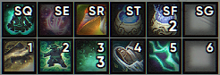
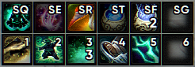

# Qalibr

Custom skin for [Masque](https://github.com/SFX-WoW/Masque). Comes in three opacity variants. 

## Example

Featured example is *Low* opacity.

*Without backdrop*

*With backdrop*

## License

Distributed under modified MIT License. See `LICENSE` for more information.
